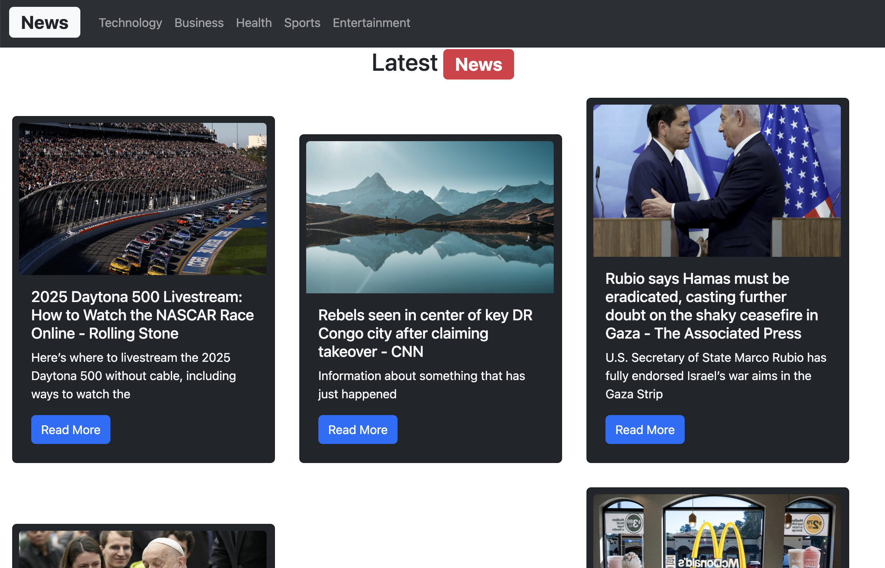

# 🌟 News App - Latest News from Multiple Categories

An interactive web application that allows users to view the latest news articles from different categories using the **NewsAPI**. The app dynamically fetches articles based on the selected category and displays them with an easy-to-use interface.



## 🚀 Features  
- 🔍 **Filter News by Category**: Select a category (e.g., Technology, Business, Health) to view the latest articles.  
- 📄 **Fetch Latest Articles**: View the most up-to-date news from around the world.  
- 📰 **Clickable Articles**: Each article links directly to the full source.  
- 🖼 **Image Display**: Displays images associated with each article or a default image if not available.  
- 📑 **Responsive Layout**: The app is designed to work on both desktop and mobile devices.

## 🛠 Technologies Used  
- **React** - For building the interactive user interface.  
- **NewsAPI** - Fetching the latest news articles.  
- **JavaScript (ES6)** - Handling dynamic content and data fetching.  
- **Bootstrap** - Styling and responsive design.

## 📦 Installation & Setup  

1. **Clone this repository**:
    ```bash
    git clone https://github.com/your-username/news-app.git
    ```

2. **Navigate to the project folder**:
    ```bash
    cd news-app
    ```

3. **Install dependencies**:
    ```bash
    npm install
    ```

4. **Create a `.env` file** and add your NewsAPI key:
    ```env
    VITE_API_KEY=your_news_api_key_here
    ```

5. **Start the development server**:
    ```bash
    npm run dev
    ```

6. **Open `http://localhost:3000`** in your browser.

## 🔑 API Key Setup

This project requires a **NewsAPI key**. To get started:

1. Sign up at [NewsAPI](https://newsapi.org/) and generate an API key.
2. Create a .env file in the root of your project.
3. Add the following line to your .env file, replacing your_news_api_key_here with your actual key:
    ```env
    VITE_API_KEY=your_news_api_key_here
    ```
4. Restart the development server after adding the key to ensure it is loaded properly.

## 🚀 How to Use

1. Open the app in your browser.
2. Select a news category (e.g., Technology, Business, Sports) from the navigation bar.
3. Browse the latest news articles in your chosen category.
4. Click on "Read More" to view the full article.

## 📜 License

This project is open-source and available under the **MIT License**. See the [LICENSE](LICENSE) file for more details.
